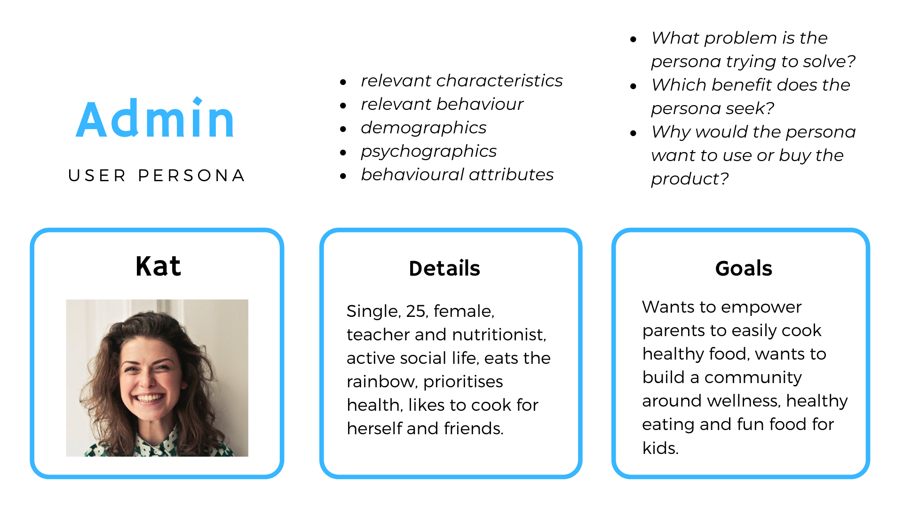

# Well Kids App #

## Installation ##

git clone `https://github.com/DBThompson713/KatApp_React.git`

## Intro ##

Well Kids is a healthy recipes application for kids. The purpose of Well Kids is to empower parents to cook quick, healthy meals for their children.

#### Tech stack

##### Front-end:
- HTML, CSS/SASS
- React - JavaScript library for building user interfaces
- Redux - JavaScript library for managing application state

##### Cloud:
- Amazon S3 - object storage service

##### Third party/other:
- Auth0 - authentication and authorisation for web applications

#### Frontend

### Packages ###

#### DevDependencies ####

* http-proxy-middleware - configure proxy middleware with ease for connect, express, browser-sync

#### Dependencies ####

* auth0-spa-js - the Auth0 Single Page App SDK is a new JavaScript library for implementing authentication & authorization in single page apps
* jest-dom - custom jest matchers to test the state of the DOM
* react - JavaScript library for building user interfaces
* user-event - simple and complete DOM testing utilities that encourage good testing practices
* axios - used for api calls
* bootstrap - css framework
* dotenv - dotenv is a zero-dependency module that loads environment variables from a .env file into process.env
* normalize.css - resets default browser styling
* react-bootstrap - front end framework
* react-dom -  package provides DOM-specific methods that can be used at the top level of your app and as an escape hatch to get outside of the React model if you need to
* react-redux - react bindings for redux
* react-router-dom - dom bindings for react router
* react-s3 - libray for upload any type of files to Amazon AWS S3
* react-scripts - scripts and configuration used by Create React App
* redux - predictable state container for JavaScript apps
* redux-form - a higher order component decorator for forms using Redux and React
* redux-thunk - thunk middleware for redux

#### Backend

#### Functionality / features
1. **Admin dashboard** - the client can manage community flagged recipes and feature recipes.
2. **Community flagging of content** - as a community, users are responible for flagging inappropriate content through a form. The flagged recipe shows up in the Admin dashboard where only the Admin can delete it.
3. **Auth0 authentication and authorisation** - easy for users to manage their password with socials, provides a high level of security for the user.
4. **Comment on a recipe** - the community can share their experiences making the recipe.
5. **Rate a recipe** - a counting system based off how many claps users have attributed to the recipe. The applaud rating system was chosen over a standard 5 star rating system.

##### Future feature considerations
6. **Favourite a recipe** - users can easily return to their favourite recipes.
7. **Share a recipe** - admin can cross-promote website recipes to her business social media profiles, users can share recipes they like with their social network.

------

#### Target audience

#### UX/UI design documentation

Documenting the evolution of user stories

##### Brain storming user stories

##### Simplifying user personas

##### Scrum Poker: Estimating User Story priority and complexity

1. Grab a set of scrum poker cards
2. Each player receives card values of 1, 2, 3, 5, 8, 13, 21 and a break card
3. The project lead reads out a user story
4. Each team member votes on story priority then story complexity
5. The lowest and highest card value holders explain why they chose their numbers
6. The team members can change their vote, card numbers are totalled and divided by the number of team members
7. This number is recorded on the user story and plotted on a grid to determine which tasks should be completed first, second and last
8. User stories are delegated to team members based on their placement on the grid below

##### Adding scrum values to user stories during scrum poker

##### Final User Stories organised by app features

#### Wireframes & Mockups

- *Wireframes were created with Balsamiq*
- *Mockups were created with Adobe XD*

[Navigatable Desktop Mockup](https://xd.adobe.com/view/caa39ebc-0746-4846-530d-b68a07023d3e-bc92/?fullscreen&hints=off)
[Navigatable Mobile Mockup](https://xd.adobe.com/view/f49a4364-4b14-4a2a-58aa-d1160b0f5e65-82ab/?fullscreen&hints=off)

## Homepage

------

#### Testing

##### Development & Production Testing

[Link to manual test spreadsheet](https://docs.google.com/spreadsheets/d/1LBLUaXR191t0HC_BJbGhc7i397YmtS1Q_rQPLP_ObNs/edit?usp=sharing)